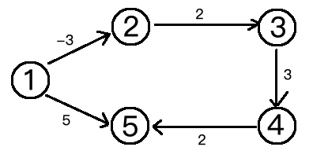

## 最短路徑 貝爾曼-福特演算法(Bellman-Ford) 

### 前言
>之前在資料結構中學過的 Floyd-Warshall 或 Dijkstra 演算法，雖然都很好用也好理解，但卻有一個缺點是無法解決帶有「負權迴路」 (或稱「負權環」) 的圖，因為帶有負權迴路的圖沒有最短路徑。而 Floyd-Warshall 演算法是用多點進行中轉，但如果中轉的過程有負權邊的話，會造成沒有最短路徑，會不斷的繞圈圈。<br>
而 Dijkstra 演算法無法解決帶有負權邊 (邊的權值為負數) 的圖。基於貪心策略，每次鬆弛前會先找到一個最短距離的點變確定值，但如果下次擴展的時候遇到負權的邊會產生更短的路程，有可能破壞已經更新的點路程不會改變的性質。<br>
所以今天介紹的 Bellman-Ford 演算法 便可以完美的解決這件事。在演算法中對邊鬆弛的模式和 Dijkstra 演算法一模一樣，但不同的是不用找出最短距離的確定值，而是用所有頂點的邊的資訊做 n-1 (頂點為 n 個) 輪的鬆弛，這樣就不會像 Dijkstra 演算法中的最短路徑為確定值而無法繼續鬆弛。
#

以下圖為例



編列出的順序是：


一樣先用一個 dis 陣列來儲存 1 號頂點到所有頂點的距離，但在還沒鬆弛前，全部設為無窮大。

|  | 1| 2 | 3 | 4 | 5 |
| :------: | :-----: | :-----: | :-----: | :----: | :----: |
| dis | 0 | ∞ | ∞ | ∞ | ∞ |

現在進行第一輪鬆弛，首先依次讀入邊的資訊進行鬆弛，第一條是 `2 3 2`<br>
dis[3] = ∞，dis[2] + 2 = ∞ + 2 = ∞，所以鬆弛失敗。

|  | 1| 2 | 3 | 4 | 5 |
| :------: | :-----: | :-----: | :-----: | :----: | :----: |
| dis | 0 | ∞ | ∞ | ∞ | ∞ |

第二條是 `1 2 -3`<br>
dis[2] = ∞ > dis[1] + (-3)，鬆弛成功。

|  | 1| 2 | 3 | 4 | 5 |
| :------: | :-----: | :-----: | :-----: | :----: | :----: |
| dis | 0 | -3 | ∞ | ∞ | ∞ |

接至繼續讀入邊的資訊進行鬆弛到結束。第一輪鬆弛完畢。

|  | 1| 2 | 3 | 4 | 5 |
| :------: | :-----: | :-----: | :-----: | :----: | :----: |
| dis | 0 | -3 | ∞ | ∞ | 5 |

第二輪再從頭開始讀入邊的資訊進行鬆弛，鬆弛完畢的結果：

|  | 1| 2 | 3 | 4 | 5 |
| :------: | :-----: | :-----: | :-----: | :----: | :----: |
| dis | 0 | -3 | -1 | -2 | 5 |

因為 n 個頂點最多包含 n-1 個邊的路徑，所以最多進行 n-1 輪就行了。

>如果在進行 n-1 輪的鬆弛後，仍然可以繼續鬆弛成功的話，那麼此圖就存在負權迴路。因為最短路徑所包含的邊最多為 n-1 條，在 n-1 輪的鬆弛後最短路徑不會再發生變化。如果 n-1 輪鬆弛後最短路徑仍發生變化，則該圖必然存在負權迴路。這也是 Bellman-Ford 演算法可以用來檢測圖是否含有負權迴路。

## 程式碼
```
import numpy as np

n, m = map(int, input().split(' '))

dis = np.zeros(10, dtype=np.int)
bak = np.zeros(10, dtype=np.int)

u = np.zeros(10, dtype=np.int)
v = np.zeros(10, dtype=np.int)
w = np.zeros(10, dtype=np.int)
inf = 99999999

# 讀入邊
for i in range(1, m+1):
    u[i], v[i], w[i] = map(int, input().split(' '))

# 初始化 dis 陣列，此處用 1 號頂點到其餘各點的初始路程
for i in range(1, n+1):
    dis[i] = inf
dis[1] = 0

# Bellman-Ford Algorithm
for k in range(1, n):
    # 將 dis 陣列備份到 bak 陣列中
    for i in range(1, n+1):
        bak[i] = dis[i]
    # 進行一輪鬆弛
    for i in range(1, m+1):
        if dis[v[i]] > dis[u[i]] + w[i] :
            dis[v[i]] = dis[u[i]] + w[i]
    # 鬆弛完畢檢測 dis 陣列有無更新
    check = 0
    for i in range(1, n+1):
        if bak[i] != dis[i]:
            check = 1
            break
    # 如果 dis 陣列沒有更新，提前退出演算法迴圈
    if check == 0:
        break

# 檢測負權迴路
flag = 0
for i in range(1, m+1):
    if dis[v[i]] > dis[u[i]] + w[i]:
        flag = 1
if flag == 1 :
    print("此圖含有負權迴路")
else:
    # 輸出最終結果
    for i in range(1, n+1):
        print(dis[i])

'''
5 5
2 3 2
1 2 -3
1 5 5
4 5 2
3 4 3
'''

```

參考資料<br>
* https://ithelp.ithome.com.tw/search?search=演算法&tab=question
* https://zh.wikipedia.org/wiki/贝尔曼-福特算法
* https://zh.wikipedia.org/wiki/最短路径快速算法
* https://medium.com/@yining1204/演算法圖鑑讀書筆記-第肆章-圖形搜尋-中-61e9190329e0