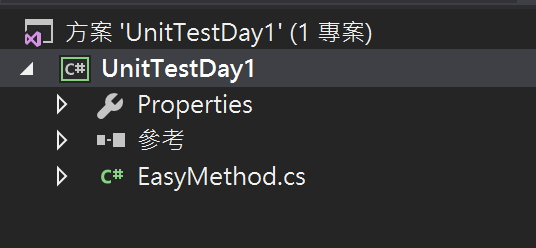
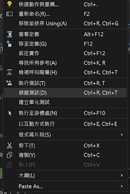
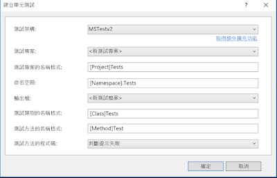
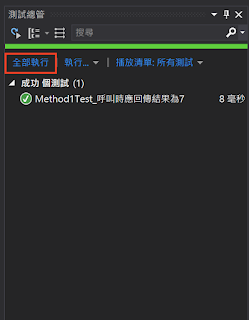
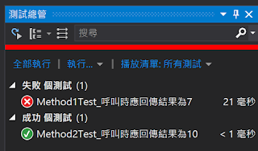
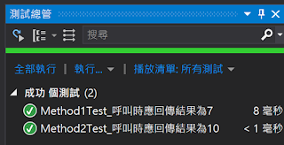

## 為何要寫單元測試?

* 優良的單元測試就像活著的規格書，不僅能幫助你了解那些不是你負責的功能，更是能夠執行的規格書。
* 它能告訴你目前的程式，是否執行都符合當時所要求的規格與產出結果，如果舊規格舊方法沒有改的情況下，單元測試壞了，那就表示你這次的改動絕對有影響到它。
* 它能即時的驗證你的想法，而不是到上線時才賭人品，尤其是那些你覺得理所當然會對的功能中，魔鬼往往藏在細節裡。

## 開始寫單元測試

首先準備一個類別庫專案



寫下一段簡單的程式

```
public class EasyMethod
{
    private int BaseNumber = 5 ;

    public int Method1()
    {
        return BaseNumber + 2;
        }
}
```

接著建立單元測試專案




### 進行第一個完整的單元測試

將那個自動建立的單元測試改成
```
[TestMethod()]
public void Method1Test_呼叫時應回傳結果為7()
{
    //arrange
    var Sut = new EasyMethod () ;
    var expected = 7;

    //act
    var actual = Sut.Method10);

    //assert
    Assert.AreEqual (expected, actual) ;
}

```

接著在測試總管中執行單元測試，知道目前這個方法符合我們需求跟得到預期的結果。



## 當我們面臨更改

首先我先將基數改成2，並且新增一個Method2的方法，並且讓他加上基數後得到10這個結果回傳。

```
namespace UnitTestDay1
{
    public class EasyMethod
    {
        private int BaseNumber = 2 ;

        public int Method1()
        {
            return BaseNumber + 2 ;
        }
         public int Method2()
        {
            return BaseNumber + 8 ;
        }
    }
}
```
建立單元測試，並寫上新的方法的單元測試
```
namespace UnitTestDayl.Tests
{
    [TestClass ()]
    public class EasyMethodTests
    {
        [TestMethod()]
        public void Method1Test_呼叫時應回傳結果為7()
        {
            //arrange
            var Sut = new EasyMethod () ;
            var expected = 7 ;

            //act
            var actual = Sut.Method1 () ;

            //assert
            Assert.AreEqual (expected, actual) ;
        }

        [TestMethod()]
        public void Method1Test_呼叫時應回傳結果為10()
        {
            //arrange
            var Sut = new EasyMethod () ;
            var expected = 10 ;

            //act
            var actual = Sut.Method2 () ;

            //assert
            Assert.AreEqual (expected, actual) ;
        }
    }
}

```

結果原本的Method1壞掉了。



原來因為我們更改了基數所以造成了Method1回傳時不符合當時所制定的規格，這時候我們如果確定原需求沒有變動的情況下，那就是去修改原本的方法讓它能通過單元測試。這樣新舊需求就都確保正確的情況下更正完成了。

```
namespace UnitTestDay1
{
    public class EasyMethod
    {
        private int BaseNumber = 2 ;

        public int Method1()
        {
            return BaseNumber + 5 ;
        }
         public int Method2()
        {
            return BaseNumber + 8 ;
        }
    }
}
```


### 參考資料
* https://docs.microsoft.com/zh-tw/visualstudio/test/unit-test-basics?view=vs-2022
* https://ithelp.ithome.com.tw/articles/10102643
* https://zh-tw.coderbridge.com/series/89e2405766bc423b965adcdd4af244a0/posts/a64e5ee6b2a34d09ad6cc3f5aa2f69d9